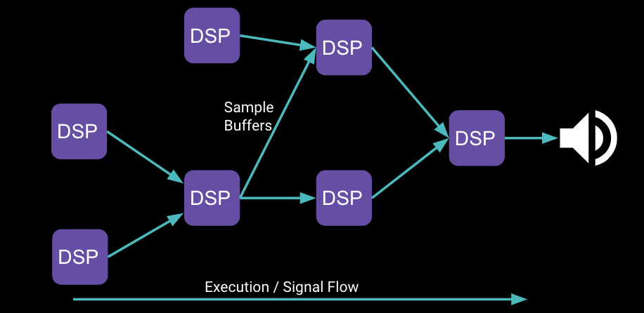

# About DSPGraph

Digital Signal Processing Graph (DSPGraph) is the new low level audio engine for Unity

DSPGraph is Unity’s new audio rendering technology. It is a low-level audio mixing engine. DSPGraph is being developed because of scalability issues, technical debt, and functional limitations with FMOD.

DSPGraph is a directed acyclic graph that processes and manipulates audio samples by adding filters and effects before rendering to an output device. DSPGraph is a layer that consists of the following:
- DSPGraph: the container.
- DSPNode: configurable nodes that are easily customizable to suit user needs.
- DSPSampleProvider: provides audio samples to the graph.
- DSPCommandBlock: a processing system that defines how the graph is supposed to function. 
- DSPConnection: the weighted connection between two nodes in the graph.

This new mixing engine is written in C#, inside of Unity’s C# Job System and thus can use the Burst compiler and provide a highly performant audio rendering layer. Here are some of the advantages of this new design:
- Allows for building an audio system in C# which is well integrated with other systems of Unity.
- Effects, graph structure, parameters, and mixing are in C#. 
- There is no hidden runtime code, apart from the job scheduling engine. 
- The audio system yields better performance and parallelization.

